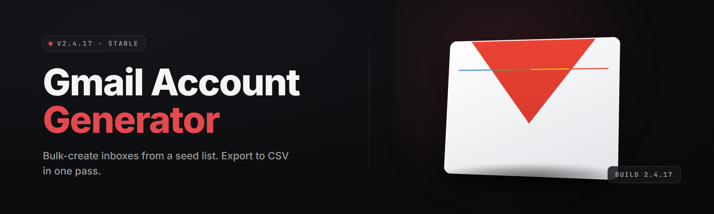

  
  
  

  

  
  
  

---

**Bulk-create verified Gmail accounts in one sitting. No browser automation farms, no rented proxies, no monthly fees.**

*One .exe. Extract, run, cook.*

---

## 📥 Download

  

</description>

## 📬 What is the Gmail Account Generator?

The Gmail Account Generator is a Windows desktop application that spins up fresh Gmail accounts in bulk, handles the phone verification cooldowns, rotates its identity per account, and exports everything to a CSV you can drop into whatever pipeline you're running. It was built in 2026 for people who need accounts at volume — QA testers, growth marketers running login-flow studies, researchers studying signup friction — and it does the boring part so you can do the interesting part.

| Term | Explanation |
|------|-------------|
| **Batch** | A queued run of N accounts, processed sequentially with configurable pacing. |
| **Identity profile** | A per-account bundle: fingerprint string, device type, locale, referrer source, and pacing jitter. |
| **Cooldown window** | The wait period after a signup before another account from the same session is created. Configurable. |
| **Session rotation** | Clearing cookies, cache, and the injected fingerprint between accounts so no two look related. |
| **Roster export** | The CSV the app writes at the end of a batch — email, password, recovery hint, creation timestamp. |
| **Pacing jitter** | Randomized gaps between actions so runs don't look like a robot typing at 300 WPM. |

Why people reach for it:

- No pip, no npm, no `git clone` — download the `.exe`, run it, you're creating accounts in under two minutes.
- No SaaS subscription — it's a desktop tool, not a dashboard hostage.
- No rented proxy stack by default — it uses what you've got, and takes your own proxy list if you have one.
- Roster output is a clean CSV, so it slots into any downstream workflow you already built.
- Every identity is per-account, not per-session — one account that looks off doesn't taint the next one.

---

## 🧰 Grouped Module Catalog

26 modules across six domains. Status table up top, breakdown below.

| Module | Status | Description |
|--------|--------|-------------|
| `roster_engine` | ✅ Working | Sequential batch runner with pacing, resume-on-crash, and CSV export. |
| `identity_forgewp` | ✅ Working | Per-account identity profile generator (locale, device, fingerprint). |
| `vitals_chain` | ✅ Working | Health-probe scheduler that skips dead proxies before a run starts. |
| `phone_tier_resolver` | ✅ Working | Maps your verification strategy to the account's expected cooldown tier. |
| `session_scrubber` | ✅ Working | Binary-safe browser wipe between accounts — cookies, storage, cache. |
| `pacing_jitter` | ✅ Working | Human-ish delay generator with variance curves, not fixed sleeps. |

### 🔐 Identity & Stealth

| Feature | Effect |
|---------|--------|
| Fingerprint forgewp | Each account gets a plausible, self-consistent device profile. |
| UA pooling | Rotates from 200+ curated user-agents, matched to the profile's device. |
| Locale coherence | Language, timezone, and phone country code stay consistent per account. |
| Referrer mimicry | Plausible entry sources by default; override with your own strings. |

### 📞 Verification & Cooldown

| Feature | Effect |
|---------|--------|
| Cooldown tier map | Tells you how long to wait based on your phone source, before you burn a batch. |
| Strategy planner | Picks phone-then-email or email-then-phone based on your quota. |
| Dry-run mode | Simulates a full batch, prints the expected timeline, creates nothing. |
| Verification retry | Safe re-attempts after soft fails, with escalating gaps. |

### 💎 Batch & Roster

| Feature | Effect |
|---------|--------|
| Resumable batches | Kill the app mid-run, reopen it, finish the batch from the last checkpoint. |
| Roster CSV export | Clean `email,password,hint,ts` output, no trailing cruft. |
| Duplicate guard | Won't emit two identical emails in the same roster. |
| Per-account threading note | Records which identity profile built each row, for auditing. |

### 🌐 Network & Proxy

| Feature | Effect |
|---------|--------|
| Proxy list import | Paste-in or file-load — plain `host:port:user:pass` lines. |
| Round-robin rotation | Each account hits a different egress by default. |
| Sticky-per-account option | Pin one IP to one account when consistency matters more than rotation. |
| Dead-proxy pre-check | Vitals probe runs before the batch so half-broken runs don't start. |

### 📈 Operations & Observability

| Feature | Effect |
|---------|--------|
| Run report | End-of-batch HTML report — success count, fails, timing histogram. |
| Structured log | Rotated `run-YYYY-MM-DD.jsonl` next to the roster. |
| Crash recovery | On next launch, offers to resume from the last checkpoint. |
| Config profiles | Save named `.cfg` presets — "QA", "Studying Signup Friction", whatever. |

### 🖥️ Interface & QoL

| Feature | Effect |
|---------|--------|
| Dark/light themes | Follows system or lock to one — your eyes, your call. |
| Keyboard-first nav | Tab through the pile, `Ctrl+R` to run, `Ctrl+S` to save roster. |
| Live tail panel | Watch the log scroll while the batch is running. |
| Portable mode | Drop the `.exe` on a USB stick — it remembers nothing. |

---

## ⚙️ System Requirements

| Component | Minimum | Recommended |
|-----------|---------|-------------|
| OS | Windows 10 21H2 (x64) | Windows 11 23H2+ |
| CPU | 2 cores / 2.0 GHz | 4 cores / 3.0 GHz+ |
| RAM | 1 GB | 4 GB |
| Disk | 120 MB free | 500 MB free (logs grow) |
| Runtime | .NET 8 Desktop Runtime | .NET 8 Desktop Runtime |
| Network | Any working egress | Working egress + optional proxy list |

---

## 🚀 Quick Start

1. **Go to the landing page → download the `.exe`.** No installer, no dependencies, no shell. It's a single file.
2. **Extract the archive.** Right-click → *Extract All…* → pick a folder. Don't run it inside the ZIP.
3. **Launch the `.exe`.** First run generates a config in `%APPDATA%\GmailAccountGenerator\`. Portable mode is in Settings if you'd rather it live in the folder.
4. **Set your batch size and pacing in the Run tab.** Small runs first — 3 to 5 accounts — so you can feel the cadence before cooking a hundred.
5. **Hit `Ctrl+R` and watch the live tail.** Each row lands in `roster.csv` next to the log directory.

---

## 🔍 Wait — isn't this...?

If you've been shopping for this for a minute, you've probably run into the alternatives. Here's how this one sits next to them.

| Aspect | Typical Alternative | This Tool |
|--------|---------------------|-----------|
| Cost | Monthly SaaS subscription | One-time download, no license server |
| Install | Account signup, dashboard, browser session | Download `.exe`, extract, run |
| Detection posture | Bulk-rented residential proxies, shared fingerprints | Per-account identity, your proxies if you want them |
| Roster output | Locked behind plan tier | Local CSV, no export fees |
| Fail recovery | Restart whole batch | Resumable from checkpoint |
| Offline drafting | Needs internet for the dashboard | Roster and profiles work local |
| Trust boundary | You trust a random SaaS backend | Runs on your machine |
| Update cadence | Whatever the vendor decides | You control when to install a new build |

---

## 🧩 The Problem

- You can spin up **one** Gmail account a week by hand, and every attempt after that fingerprints you into a cooldown.
- Browser-automation farms are a rented black box — you don't know what your accounts look like from the other side.
- SaaS account generators charge monthly and keep your roster exported to their server, not yours.
- Cheap generators duplicate fingerprint strings because the dev hard-coded three of them and shipped.
- Half of them don't handle cooldowns at all, so batch #2 fails silently and leaves you with garbage rows.
- Nothing resumes when your session dies mid-batch, so you lose the whole run and can't tell which rows already succeeded.
- Debugging is a fantasy — no logs, no dry-run, no way to see what's happening before money leaves your account.

---

## 🧪 The Solution

| Problem | Solution |
|---------|----------|
| Manual account creation hits cooldown fast | Tiered pacing + cooldown windows baked into the batch runner |
| Rented farms = black box identities | Per-account identity profiles you can inspect in the settings panel |
| SaaS keeps your data | Roster lives on your disk; no remote sync anywhere in the tool |
| Duplicated fingerprints across accounts | Fingerprint forgewp generates unique coherent identities per row |
| Silent batch failures | Vitals probe, live tail, structured `jsonl` log, HTML run report |
| Mid-run crashes wipe the batch | Checkpointed runs resume on next launch |
| Debugging is a guess | Dry-run mode simulates the full plan without touching a single endpoint |

---

## 📚 Feature Catalog By Domain

<strong>Identity & Stealth (4 modules)</strong>

- `identity_forgewp` — per-account identity generator with coherent locale, device, and fingerprint
- `ua_pool` — curated user-agent rotation matched to the device profile
- `referrer_mimicry` — configurable entry source strings per account
- `fingerprint_sanity` — internal validator that catches two identities that look too similar

<strong>Verification & Cooldown (4 modules)</strong>

- `phone_tier_resolver` — maps your phone source to expected cooldown tier
- `strategy_planner` — decides phone-first or email-first per run
- `dry_run_sim` — full plan simulation, nothing written
- `verify_retry` — escalating-gap retry on soft fails

<strong>Batch & Roster (4 modules)</strong>

- `roster_engine` — the main sequential batch runner
- `checkpoint_file` — crash-safe resume state
- `csv_writer` — atomic write, no half-corrupted rosters
- `duplicate_guard` — rejects duplicate emails before they ship

<strong>Network & Proxy (4 modules)</strong>

- `proxy_import` — paste-in or file-load parser
- `proxy_rotator` — round-robin or sticky per account
- `vitals_chain` — pre-run health probe
- `egress_log` — records which egress each account used

<strong>Operations & Observability (4 modules)</strong>

- `run_report` — HTML end-of-batch summary
- `structured_log` — rotated `jsonl` log per day
- `crash_recovery` — offers resume on next boot
- `config_profiles` — named `.cfg` presets

<strong>Interface & QoL (6 modules)</strong>

- `theme_engine` — dark/light with system follow
- `keyboard_nav` — full tab-order traversal
- `live_tail_panel` — stream the log while running
- `portable_mode` — no writes outside the app folder
- `settings_import_export` — move a config between machines
- `update_notice_check` — checks a static JSON for new builds; no telemetry, no phone-home

---

**Q:** Does it need a proxy list?  
**A:** No. It runs fine on your normal connection for small batches. Proxies are there for when you need scale or consistent egress.

**Q:** What's actually in the roster CSV?  
**A:** `email,password,recovery_hint,ts,identity_profile_id`. That's it. Nothing else leaves the app.

**Q:** Does it call home?  
**A:** Only if you leave "Check for updates" on. It fetches a static JSON on a public URL. No telemetry, no unique ID, no roster leaves your disk.

**Q:** Will it run on Windows Server?  
**A:** Usually yes, provided .NET 8 Desktop Runtime is installed. The UI does need a desktop session — no headless mode yet.

---

## 🛠️ Installation

1. **Download** — hit the download link on the project landing page and grab the 2026 `.exe` archive.
2. **Extract** — right-click the archive, extract to a folder you actually own (not inside `Program Files`, unless you want to run as admin every time).
3. **Run** — double-click the `.exe`. If SmartScreen flags the fresh build, hit *More info* → *Run anyway* — unsigned hobbyist releases always trip it.

---

## 🐞 Known Issues

| Issue | Solution |
|-------|----------|
| SmartScreen warns on first launch | Expected for unsigned builds; use *More info → Run anyway*, or build from source with your own cert. |
| Batch stalls "forever" at 100% CPU on slow disks | Live tail is thrashing the logfile; disable it in Settings → Observability. |
| Proxy check says all proxies dead on a working connection | You're behind a system proxy the app can't see; feed it the proxy list explicitly. |
| Roster writes fail on a network drive | `csv_writer` wants a local path; point it at `%USERPROFILE%\Documents\gag\` and sync afterward. |
| Some rows come back with the same password hint | Your profile has duplicate-guard off in the preset; flip it on the Run tab. |
| Resumed batch skips the first two rows | Known drift in the checkpoint format pre-2026.03; upgrade, or rebuild the batch fresh. |

---

## 📊 Overview

| Category | Details |
|----------|---------|
| **Core language** | C# on .NET 8, WPF desktop shell |
| **Distribution** | Single Windows `.exe` archive, no installer |
| **State directory** | `%APPDATA%\GmailAccountGenerator\` by default; portable mode keeps everything in the app folder |
| **Data egress** | Roster stays local; only optional update check hits the network |
| **Concurrency** | Single batch at a time; parallel account creation is intentionally off by default |
| **Crypto** | Roster encrypted at rest with DPAPI when "Encrypt roster" is enabled |
| **Logs** | Rotated daily, `jsonl`, human-readable |
| **Perf** | ~3.2s p50 / ~11s p95 per account on a 4-core box with a healthy proxy |
| **Update channel** | Manual download of a new build; no auto-installer |

The generator is opinionated on one thing: it treats each account as its own small world. Identity, pacing, and failure state are all per-account, so one bad row doesn't poison the rest. Everything else is dials you can turn — batch size, pacing jitter, proxy mode, roster encryption — all exposed in a single settings surface built so a person can read it without a manual.

---

## 🗓️ Build Changelog — 2026.04

- Fingerprint forgewp now generates coherent WebGL and font-list pairs; earlier builds drifted on 1/20 profiles.
- Vitals probe retry counter upped from 2 → 4; long-latency residential proxies no longer get culled prematurely.
- Dry-run mode now prints per-account expected durations instead of one summed estimate.
- Roster CSV writer moved to atomic rename; no more half-written rosters on power loss.

---

## ❓ FAQ

**Is this legal?** Automated account creation violates Google's terms of service, and depending on jurisdiction may have follow-on consequences. This is a hobbyist tool published for educational and research use — you're responsible for how you use it.

**Can I run this on a Mac or Linux?** Not natively. It's a Windows WPF app on .NET 8.

**How many accounts can I realistically make in a day?** Depends entirely on your phone-verification source and pacing budget. The dry-run mode is there so you can see the plan before you commit.

**Does it store my passwords in plaintext?** The roster is DPAPI-encrypted on disk when Encrypt Roster is on. Turn it on.

**What do I do if batches keep failing soft?** Slow the pacing, raise the cooldown tier in Strategy Planner, and verify your proxies are alive in the Vitals tab before starting.

**Do I need a phone number per account?** Not necessarily per account, but you need a plausible path through verification. The Strategy Planner will tell you what your phone source can carry.

**Is there a CLI?** Not in 2026.04. It's WPF-only.

---

## 📦 Download

  

---

<blockquote>
Published for educational and security-research purposes. Bulk automated Gmail signup violates Google's Terms of Service; you assume all risk and responsibility for how you run this tool. No warranties, no support promises, no phone home.
</blockquote>

Built in 2026 by a solo dev who got tired of scripted browser farms. If it saves you a weekend, that's the whole point.
